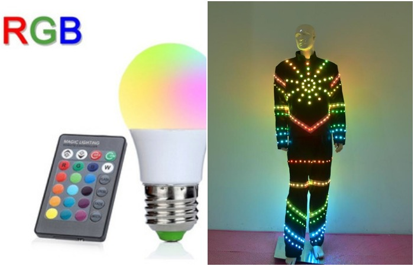
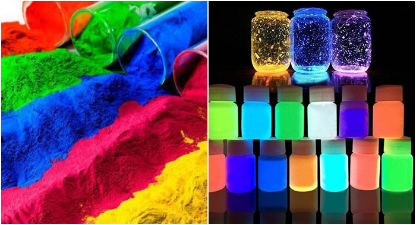
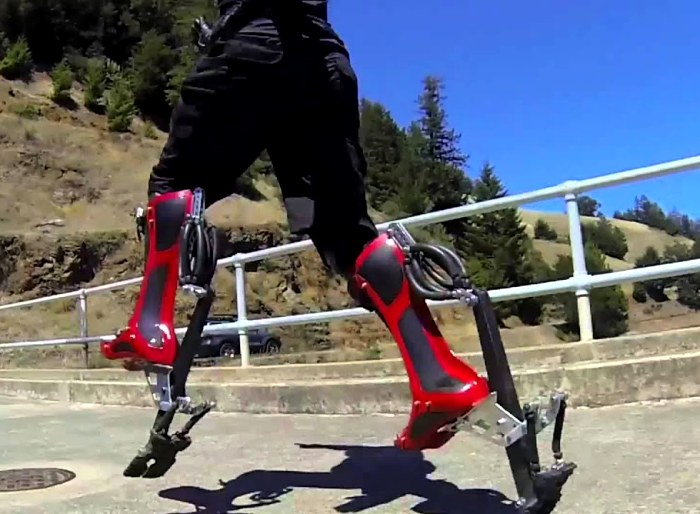
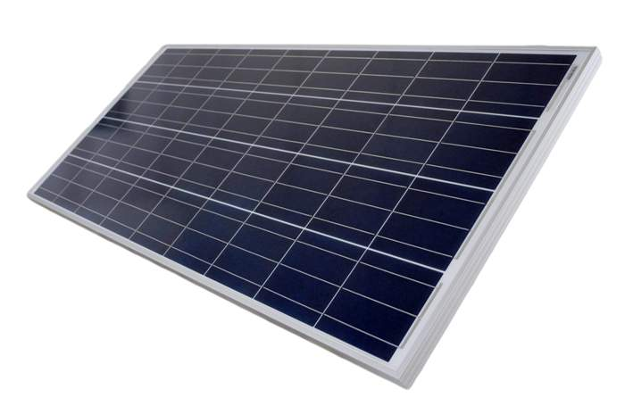
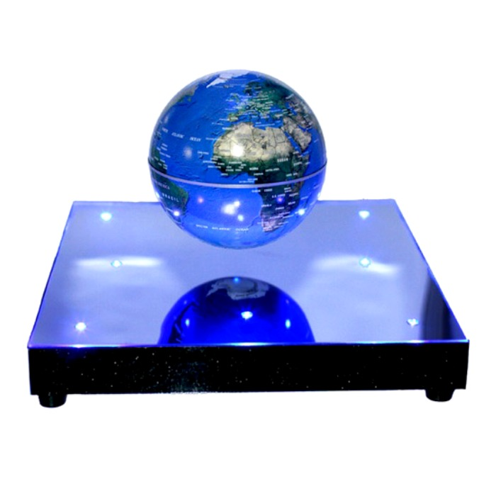
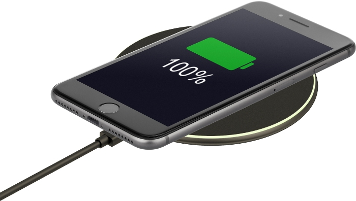
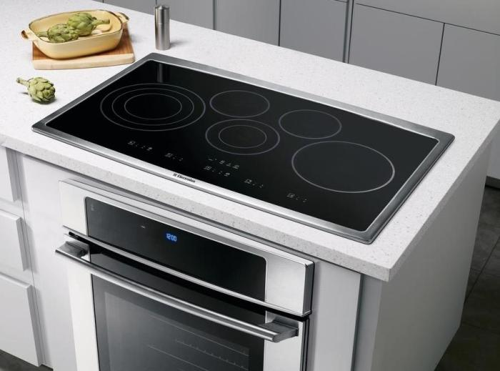

# Modern technologies that need to stop being overlooked

1. RGB backlighting

RGB is essentially red, green, and blue, which, when mixed, produce a large number of combinations of colors. With the use of this technology today is actively produced, for example, smart lamps: they are connected to them by Bluetooth, and change its parameters, such as brightness and color, at will. In addition, the change of shade can be programmed for specific time intervals.

Among other gadgets, which have also been upgraded with RGB technology, one of the most original can be called RGB clothing. Interestingly, most enthusiasts make such things themselves, with the help of RGB LED strip, which can make any detail of the image with any glowing colors.

2. "RGB" colorants

RGB technology has been actively used in recent years as a dye. They can be conventionally divided into two groups: the first - they do not luminescate - are used in the food industry, for example, they can dye rice or water. The second group includes luminescent dyes, but unlike the first, they are not adapted for use with food and should not be used, of course.

3. Bionic shoes

Many people associate bionic shoes with the same dentures, but such modernized shoes can actually be worn by anyone, regardless of their physical condition. This gadget allows you to run almost twice as fast as in conventional sneakers: according to Novate.ru, if used correctly, they are quite realistic to reach speeds up to 65 kilometers per hour. In addition, bionic shoes reduce muscle strain and general fatigue.

4. Solar panels

Solar panels seem to conquer the planet in seven-mile steps - they spread to the fields, roofs and even lanterns. However, in everyday life, we still use them very little. And in vain, because the solar panels - this is a really useful technology, which will be indispensable not only for owners of electric cars, but even for those who constantly carry a smartphone. Charging with solar panels will be carried out all year round, and energy savings - appropriate.

5. Levitron 

Levitron is a gadget that allows an object to be levitated on a special stand. To be fair, it should be noted that this technology is still being finalized and upgraded: for example, levitron still has restrictions on weight - the gadget can only lift into the air objects of small mass. In addition, the height at which you can levitate the object itself is also quite small.

6. Wireless devices

Wireless gadgets and devices have been spreading at high speeds for years, and today many of us have computer mice, keyboards or headphones. However, less attention is paid to other techniques: for example, wireless monitors are still rare and, surprisingly, charging, which in a purely practical sense is much more convenient than wired analogues.

7. Induction stove

It seems strange, but induction stoves have been on the market for a long time, and in terms of popularity they are still very much lost to their electrical and gas analogues. But consumers are ignoring this type of home appliances in vain: after all, induction stoves work more rapidly, and the functionality is wider, and consumes less energy. And most importantly - they are much safer than their predecessors.
